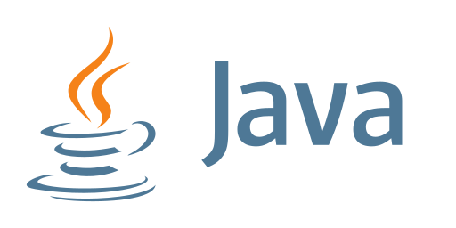

### 👋 Olá, eu sou o Josiel!

Sou um desenvolvedor de software full-stack e academico de Sistemas de Informação pela Universidade Federal do Oeste do Pará(UFOPA). Meus estudos e experiencias abrangem uma ampla gama de camadas sistemicas, incluindo Front-End(React), Backend(NodeJs). Tenho experiencias em uma ampla gama de tecnologias como isso isso e isso. 

## Experiencia Profissional e Academica : 

🧑‍🎓 Estudante do Curso de Bacharelado em Sistemas de Informação na  Universidade Federal do Oeste do Pará (UFOPA).

## Projetos e Trabalhos :

- Desenvolvimento de uma aplicação web para Astrologia
- Desenvolvimento de sistema web para arrecadação de vaquinhas online
- Desenvolvimento de Sistema de Redistribuição de servidores docente do Ensino Superior e EBTT
- Desenvolvimento de aplicativo para a cidade Oriximiná
- Monitor de cursos de Informática60+ para idosos do Serviço de Convivencia e Fortqalecimento de Vínculos(SCFV).
- Facilitador do curso de programação web e logica de programação com plataforma SCRATCH para alunos do projeto de Inclusão Digital e formação de adolescentes em vulnerabilidade social no Oeste do Pará

### Linguagens e Tecnologias

  
  
   
   
   
   
  
  
  
  
  
  
  
  

## contatos

<a href="https://www.linkedin.com/in/josiel-santos-41200b2b8/">
